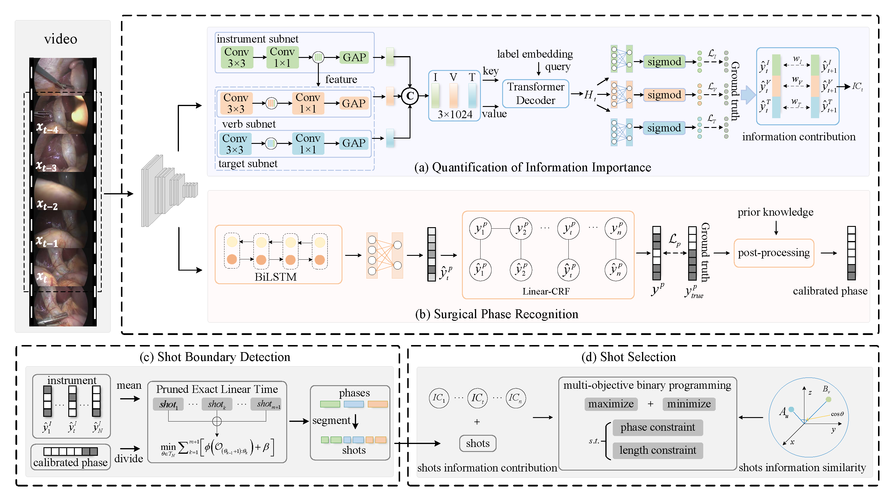

# DSVS
## Framework

  

## Abstract
Surgery video summarization can help medical professionals quickly gain the insight of the surgical process for the surgical education and skill evaluation. However, existing methods are unable to efficiently summarize information to the satisfaction of medical professionals. Since it is challenging to summarize the video while balancing the information richness and diversity. In this paper, we propose a dynamic surgery video summarization framework (DSVS). We first used a multi-task learning network to perceive and comprehend surgical action triplet components and phases. An information contribution module then measures the frame-level importance using the predicted triplets. A two-stage strategy which involving phase recognition and change-point detection further applied to divide each phase of the surgical videos into shots. Finally, A multi-objective zero-one programming model is to formulated to select the optimal subset of shots by simultaneously maximizing intra-shot information contribution and minimizing inter-shot information similarity. Experimental results on two surgical video datasets show the framework can generate summaries that encompass crucial and diverse content. Clinical validations indicate the framework is capable of summarizing the information expected by surgeons. The source code can be found at https://github.com/syypretend/DSVS.
